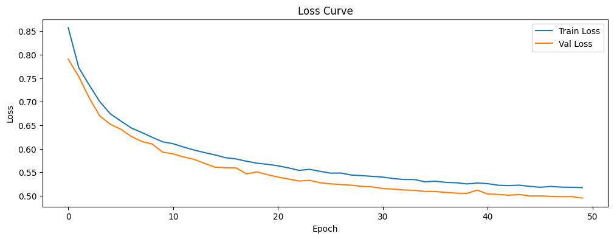
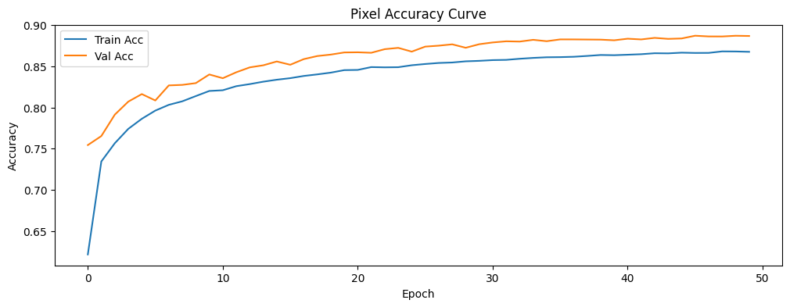
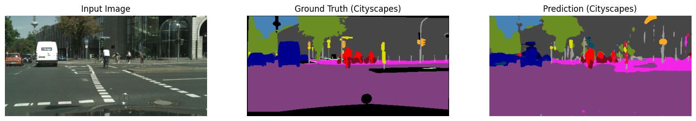

# U-Net Semantic Segmentation on Cityscapes

**ENM 5310 — Data-Driven Modeling and Probabilistic Scientific Computing | University of Pennsylvania**

A from-scratch implementation of a U-Net style encoder-decoder network for pixel-wise semantic segmentation on the Cityscapes urban driving dataset, trained end-to-end in PyTorch on Google Colab.

---

## Overview

This project implements a full semantic segmentation pipeline — from raw Cityscapes images to per-pixel class predictions across 19 urban scene categories. The architecture follows the classic U-Net design with skip connections, extended with Group Normalization, Dropout regularization, and a combined Dice + Cross-Entropy loss for handling class imbalance.

---

## Architecture

The model (`MySegNet`) is a custom U-Net with three components:

**Encoder** — 3 stages of double convolutions with max pooling:
```
Input (3, H, W) → [64] → [128] → [256] → MaxPool at each stage
```

**Bottleneck** — single ConvBlock expanding to 512 channels.

**Decoder** — transposed convolution upsampling with skip connection concatenation:
```
512 → concat(256) → 256 → concat(128) → 128 → concat(64) → 64
```

**Segmentation Head** — 1×1 convolution projecting to 19 class logits.

Each `ConvBlock` consists of:
- Conv2d (3×3, padding=1) → GroupNorm → ReLU
- Conv2d (3×3, padding=1) → GroupNorm → ReLU
- Dropout2d (p=0.1)

Group Normalization (instead of BatchNorm) was chosen for stability at small batch sizes.

---

## Dataset

**Cityscapes** — urban street scene dataset captured from a moving vehicle across 50 cities.

- **Training set**: 2,975 finely annotated images
- **Validation set**: 500 images
- **Resolution**: resized to 256×512 for training
- **Classes**: 19 semantic categories (road, sidewalk, building, wall, fence, pole, traffic light, traffic sign, vegetation, terrain, sky, person, rider, car, truck, bus, train, motorcycle, bicycle)
- **Label mapping**: official Cityscapes `id → trainId` mapping with `ignore_index=255` for ambiguous/unlabeled pixels

---

## Training Setup

| Hyperparameter | Value |
|----------------|-------|
| Optimizer | AdamW |
| Learning rate | 1e-4 |
| Weight decay | 1e-4 |
| LR schedule | Exponential decay (γ=0.95) |
| Epochs | 50 |
| Batch size | 4 |
| Loss | Dice Loss + Weighted Cross-Entropy |
| Input resolution | 256×512 |

**Data augmentation** (training only):
- Random horizontal flip (p=0.5)
- Gaussian noise (var 2–8, p=0.15)
- Random brightness/contrast (±0.1, p=0.2)
- ImageNet normalization (mean=[0.485, 0.456, 0.406], std=[0.229, 0.224, 0.225])

**Class weights** — manually tuned to upweight rare/small classes:

| Class | Weight |
|-------|--------|
| Road, Building, Sky, Car | 1.0 |
| Sidewalk, Vegetation, Terrain | 1.2 |
| Wall, Fence, Person, Rider, Motorcycle, Bicycle | 1.5 |
| Pole, Traffic Light, Traffic Sign | 2.0 |

---

## Loss Function

A combined loss was used to handle class imbalance and improve boundary sharpness:

```
Loss = Dice Loss + Weighted Cross-Entropy
```

**Dice Loss** computes per-class soft overlap between predicted probabilities and one-hot targets, averaged across all 19 classes (with ignore pixels masked out).

**Weighted Cross-Entropy** applies per-class weights to penalize misclassification of rare categories (poles, traffic lights, cyclists) more heavily than dominant classes (road, sky).

---

## Evaluation Metrics

**Pixel Accuracy** — fraction of correctly classified pixels (ignoring `ignore_index=255`):

```python
correct = (preds == labels) & (labels != 255)
accuracy = correct.sum() / valid_pixels.sum()
```

**Mean IoU (mIoU)** — per-class Intersection over Union averaged across all 19 classes, computed via a confusion matrix for efficiency:

```
IoU_c = TP_c / (TP_c + FP_c + FN_c)
mIoU  = mean(IoU_c for c in 0..18)
```

Classes with no ground truth pixels in the validation set are excluded from the mean (NaN-safe averaging).

---

## Results

### Loss Curve



Dice loss converges from ~0.85 (train) / ~0.79 (val) at epoch 0 down to **~0.52 train / ~0.50 val** by epoch 50. Validation loss tracks slightly below training loss throughout, consistent with the regularization effect of Dropout2d and augmentation being active only during training. No divergence or overfitting observed.

### Pixel Accuracy



Training converged steadily over 50 epochs, reaching **~86.7% train accuracy** and **~88.5% validation accuracy**. Notably, validation accuracy consistently tracks above training accuracy throughout — a direct effect of the Dropout2d regularization and data augmentation being active only during training. The model shows no signs of overfitting despite training from scratch.

### Qualitative Segmentation



The model correctly segments dominant scene structures — road, sky, buildings, and vehicles — which account for the majority of pixels and drive the high pixel accuracy. Failure modes are concentrated on small, rare, and thin classes: poles, cyclists, and distant pedestrians are either missed or coarsely localized. This is consistent with the class imbalance in Cityscapes, where road alone can occupy 30–40% of a frame while a pole may cover fewer than 100 pixels.

### Analysis and Limitations

The results expose a fundamental limitation of training a lightweight CNN from scratch on a complex 19-class urban scene dataset:

- **Dominant class bias**: even with weighted loss and upsampled rare-class penalties, large homogeneous regions (road, sky, building) dominate gradients and inflate pixel accuracy as a metric. mIoU would be a more honest measure of per-class performance.
- **Resolution bottleneck**: training at 256×512 loses fine spatial detail needed for thin structures (poles, traffic lights, bicycle wheels).
- **Limited receptive field**: the 3-stage encoder has a relatively small effective receptive field. Long-range context — e.g., recognizing that a region above a road is likely sky — requires either deeper encoders or global attention.

### Motivation for SegFormer

These limitations directly motivated extending this work to a transformer-based architecture. The attention mechanism in transformers captures global scene context from the first layer, which is precisely what a shallow CNN encoder lacks. See [SegFormer-Semantic-Segmentation](https://github.com/neelmulayPenn/SegFormer-Semantic-Segmentation) for the follow-up project using a pretrained SegFormer backbone fine-tuned on Cityscapes, with a direct performance comparison against this U-Net baseline.

---
## Skills Demonstrated

- U-Net encoder-decoder architecture implementation from scratch in PyTorch
- Multi-class semantic segmentation with 19-category Cityscapes label space
- Custom combined loss function (Dice + weighted Cross-Entropy) for class imbalance
- Data augmentation pipeline with Albumentations for joint image-mask transforms
- Per-class IoU evaluation via confusion matrix accumulation
- Group Normalization and Dropout2d for small-batch training stability
---

## Repository Structure

```
U-Net-Semantic-Segmentation/
├── U_Net_NeelMulay.ipynb     # Full pipeline: data loading, model, training, evaluation
└── results/
    ├── unet_loss_curve.png   # Dice loss curve (train vs val, 50 epochs)
    ├── unet_loss.png         # Pixel accuracy curve (train vs val, 50 epochs)
    └── unet_result.png       # Qualitative segmentation: input / ground truth / prediction
```

The notebook covers end-to-end:
1. Dataset setup (Cityscapes via `torchvision.datasets.Cityscapes`)
2. Label remapping (`id → trainId`)
3. Model definition (`MySegNet`)
4. Training loop with tqdm progress bars
5. Validation loop
6. Loss and accuracy curve plots
7. Qualitative segmentation visualizations
8. Per-class IoU computation via confusion matrix
9. Normalized confusion matrix heatmap

---

## Setup

**Dependencies:**
```bash
pip install torch torchvision albumentations opencv-python matplotlib torchmetrics cityscapesscripts
```

**Dataset:**

Download the Cityscapes dataset from [cityscapes-dataset.com](https://www.cityscapes-dataset.com/) (requires free registration). Place it at:
```
/content/drive/MyDrive/MEAM_5310/Cityscapes/
```
or update `ROOT` in the notebook to point to your local path.

**Run on Colab:**

Open `U_Net_NeelMulay.ipynb` in Google Colab, mount your Google Drive, and run all cells top-to-bottom. A GPU runtime (T4 or better) is recommended.

---
